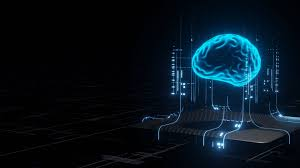

# Machine Learning Algorithms and Applications

Creator: Radhani Kapoor

## Overview



This repository is a  collection of supervised and unsupervised machine learning algorithm implementations. The goal is to explore the theory and application of fundamental ML algorithms using Python, and to understand how each method interprets and operates on real-world datasets.

Each notebook includes documented code, visualizations, and clear markdown explanations to enhance reproducibility and learning.

## Project Structure

The project is organized by learning type (supervised vs. unsupervised), and further divided by algorithm type.

### Supervised Learning
Supervised learning is a type of machine learning where the model is trained on a labeled dataset, meaning each input comes with a corresponding output label. The goal is to learn a mapping from inputs to outputs so the model can accurately predict labels for new, unseen data.
Examples: Classification and Regression 

The following algorithms are implemented:

- **Linear Regression**: Fit a line to data for continuous prediction tasks.
- **Logistic Regression**: Predict binary classes using a sigmoid transformation.
- **Perceptron**: A binary linear classifier trained via stochastic gradient descent.
- **Multilayer Neural Network**: Implemented from scratch using mini-batch gradient descent.
- **Decision Trees & Regression Trees**: Tree-based models for both classification and regression.
- **Random Forests**: Ensemble method combining multiple decision trees for improved performance.
- **Ensemble Methods**: Techniques like bagging and boosting to enhance model stability and accuracy.

Click [here](https://www.geeksforgeeks.org/supervised-machine-learning/) for more information on Supervised Learning

### Unsupervised Learning
Unsupervised learning is a type of machine learning where the model is given input data without labeled responses. The goal is to uncover hidden patterns, structures, or groupings in the data without prior knowledge of the outcomes.

The following algorithms are implemented:

- **K-Means Clustering**: Partition data into clusters based on feature similarity.
- **DBSCAN**: Density-based clustering to detect arbitrarily shaped clusters and noise.
- **Principal Component Analysis (PCA)**: Reduce dimensionality while preserving variance.
- **Singular Value Decomposition (SVD)**: Used for dimensionality reduction and image compression.

click [here](https://www.geeksforgeeks.org/unsupervised-learning/) for more information on Unsupervised Learning

---

## Tools and Technologies

- **Language**: Python 3
- **Libraries**: `numpy`, `pandas`, `matplotlib`, `scikit-learn`, `seaborn`
- **Environment**: Jupyter Notebooks for interactive coding and visualization

This repo uses a combination of algorithms from [scikit-learn](https://scikit-learn.org/stable/) and self build.

---

## Attribution

- The original course content and structure inspiration came from [Dr. Randy R. Davila's public GitHub repository](https://github.com/RandyRDavila/Data_Science_and_Machine_Learning_Spring_2022).
-  **ChatGPT** was used as a writing and organization aid.

---

## Reproducibility

All notebooks are self-contained and designed to be reproducible. Each script includes:
- Data loading steps
- Preprocessing pipelines
- Training and evaluation procedures
- Visualization of results

## How to Use

### Clone the Repo

```bash
git clone https://github.com/t0dd26/CMOR438-Spring-2025.git
cd CMOR438-Spring-2025
```

### Install Dependencies

```bash
pip install -r requirements.txt
```

### Launch Jupyter

```bash
jupyter lab
```

Then open any notebook under `notebooks/`.

